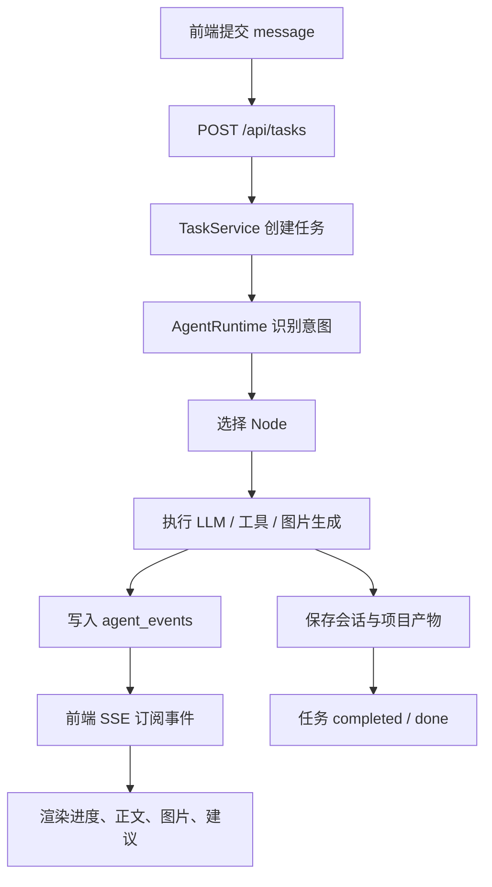

# Kaiwu AI 创业智能体

Kaiwu 是一个面向 OPC 创业者的 AI 创业工作台。它把「想法诊断、市场调研、品牌与商业方案、产品规划、图片生成、营销方案、营销文案、文件归档」串成任务驱动的智能体流程，让创业项目从模糊想法逐步沉淀为可执行资料。

项目采用前后端分离架构：

- 前端：Vite + React + TypeScript，提供桌面工作台、对话流、技能库、项目库与图片/文件预览。
- 后端：FastAPI，负责意图识别、任务生命周期、SSE 事件流、LLM 调用、文件归档和会话持久化。
- 任务运行时：`POST /api/tasks` 创建任务，`GET /api/tasks/{id}/events` 通过 SSE 订阅进度与内容。

## 功能概览

### 创业智能体节点

| 节点 | 名称 | 主要职责 |
| --- | --- | --- |
| `node0` | 用户诊断 | 了解创始人背景、资源、动机和约束，为后续分析建立上下文 |
| `node1` | 市场调研 | 联网搜索行业数据，分析需求、竞品、用户画像和机会点 |
| `node1.5` | 品牌设计 | 提炼核心人群精神，构建品牌屋，生成 Logo/品牌故事/产品调性提示词 |
| `node2` | 商业方案设计 | 输出商业模式、品牌定位、产品线和落地执行方案 |
| `node3` | 产品设计 | 设计首批 SKU、定价、成本与最小启动方案 |
| `node3.1` | 图片生成 | 调用 Seedream 生成 Logo 或效果图 |
| `node4` | 营销方案设计 | 基于商业与产品方案，输出内容营销框架与传播节奏 |
| `node5` | 营销文案 | 生成小红书、抖音、B 站、私域、海报等营销内容 |
| `export` | 文件导出 | 将上下文内容导出为 HTML/PDF 等项目文件 |
| `fallback` | 智能助手 | 处理非流水线问题、通用咨询与系统问题 |

### 前端工作台

- 新对话：面向创业流程的主对话入口。
- 创造模式：按「通用、需求洞察、商业方案、产品创造、营销推广」切换任务方向。
- 技能库：展示内置技能、外部技能与技能市场条目。
- 项目库：管理图片库、AI 对话产出、创业资料、产品设计、营销素材等文件夹。
- 任务控制：支持任务取消、重试、SSE 流式输出、进度条、建议追问、图片结果展示。

### 后端能力

- 任务创建、状态机、取消、重试和事件存储。
- SSE 事件流，支持断点续订阅 `after` 参数。
- DeepSeek、豆包 Seed、Seedream 等模型调用入口。
- 会话保存、历史会话查询、重命名、删除。
- 项目文件、项目图片、上传文件和技能文件 API。
- 报告模板与项目归档能力。

## 技术栈

| 层级 | 技术 |
| --- | --- |
| 前端框架 | React, TypeScript, Vite |
| 前端 UI/交互 | Framer Motion, Lucide React |
| 后端框架 | FastAPI, Uvicorn |
| 数据与持久化 | SQLAlchemy Core, Alembic, PyMySQL 兼容连接, MySQL, sidecar 回退 |
| 配置 | python-dotenv, `.env` |
| AI 服务 | DeepSeek, 豆包 Seed, 火山方舟 Seedream |
| 文档与协作 | Trellis, AGENTS.md |

## 目录结构

```text
.
├── AGENTS.md                    # AI 协作入口说明
├── README.md                    # 项目说明文档
├── docs/
│   └── sql/
│       ├── 2026-07-01-agent-tasks-events.sql
│       ├── 2026-07-08-core-persistence.sql
│       └── 2026-07-08-project-metadata.sql
├── kaiwu/                       # 前端 Vite + React + TypeScript
│   ├── package.json
│   ├── vite.config.ts
│   ├── public/
│   └── src/
│       ├── api/                 # API 客户端与任务类型
│       ├── features/
│       │   ├── chat/            # 对话面板与历史
│       │   └── layout/          # 侧边栏、主舞台、弹窗
│       ├── hooks/               # SSE、任务流、会话状态 Hook
│       ├── App.tsx
│       ├── data.ts              # 静态业务配置
│       └── types.ts
├── kaiwuback/                   # 后端 FastAPI
│   ├── .env.example             # 后端环境变量模板
│   ├── main.py                  # FastAPI 入口
│   ├── requirements.txt
│   ├── report_templates/        # HTML 报告模板
│   ├── skills-files/            # 外部技能文件
│   └── server/
│       ├── agent/               # 任务运行时、事件存储、状态机
│       ├── api/                 # FastAPI 路由注册
│       ├── intent/              # 意图识别与节点依赖校验
│       ├── llm_client/          # 模型提供商调用
│       ├── nodes/               # 节点元数据、Prompt、执行器
│       ├── orchestrator/        # LLM 编排与导出处理
│       ├── persistence/         # MySQL 持久化
│       ├── tools/               # 图片、文件、报告工具
│       └── utils/               # 通用工具
└── .trellis/                    # Trellis 项目规范、任务与工作区
```

运行时会生成以下本地目录，默认不应提交：

- `kaiwuback/conversations/`
- `kaiwuback/project-files/`
- `kaiwuback/project-images/`
- `kaiwu/dist/`
- `kaiwu/node_modules/`
- `.codex/`
- `.trellis/.runtime/`

## 环境要求

- Node.js 18+，建议 Node.js 20+
- npm 9+
- Python 3.10+
- MySQL 8.0+，完整会话历史与任务持久化建议启用
- DeepSeek / 豆包 / Seedream API Key，按需配置

> 任务事件存储在 MySQL 不可用时会退回内存模式，便于本地启动和调试；但会话保存、历史会话、项目沉淀等完整能力仍依赖数据库。

## 快速开始

### 1. 准备后端环境

Windows PowerShell：

```powershell
cd kaiwuback
python -m venv .venv
.\.venv\Scripts\Activate.ps1
pip install -r requirements.txt
Copy-Item .env.example .env
```

macOS / Linux：

```bash
cd kaiwuback
python -m venv .venv
source .venv/bin/activate
pip install -r requirements.txt
cp .env.example .env
```

然后编辑 `kaiwuback/.env`，填入真实密钥。

```dotenv
DEEPSEEK_API_KEY=sk-your-deepseek-key-here
DOUBAO_API_KEY=ark-your-doubao-key-here
SEEDREAM_API_KEY=ark-your-seedream-key-here
KAIWU_DB_HOST=localhost
KAIWU_DB_PORT=3306
KAIWU_DB_USER=
KAIWU_DB_PASSWORD=
KAIWU_DB_NAME=kaiwu
KAIWU_DB_CHARSET=utf8mb4
KAIWU_DB_POOL_SIZE=5
KAIWU_DB_MAX_OVERFLOW=10
KAIWU_DB_POOL_TIMEOUT=30
KAIWU_DB_POOL_RECYCLE=3600
KAIWU_DB_CONNECT_TIMEOUT=5
KAIWU_DB_READ_TIMEOUT=30
KAIWU_DB_WRITE_TIMEOUT=30
```

### 2. 准备数据库

创建数据库：

```sql
CREATE DATABASE IF NOT EXISTS kaiwu CHARACTER SET utf8mb4 COLLATE utf8mb4_unicode_ci;
```

运行 Alembic 迁移：

```powershell
cd kaiwuback
python -m alembic upgrade head
```

Manual SQL references are also available at `docs/sql/2026-07-08-core-persistence.sql` and `docs/sql/2026-07-08-project-metadata.sql`, but Alembic is the preferred schema path.

后端的 `EventStore` 会检查 `agent_tasks` 与 `agent_events` schema 是否可用；如果 MySQL 或 schema 不可用，任务事件会进入内存兜底。项目库/图片库元数据会优先写入 `project_folder_metadata`、`project_file_metadata` 和 `project_image_metadata`，数据库不可用时回退到旧 JSON sidecar。若要使用会话历史、任务事件和项目沉淀，请确保 `kaiwuback/.env` 中的 `KAIWU_DB_*` 配置与本地 MySQL 一致，并先运行 Alembic migration。

如需手动 SQL，请优先使用 `docs/sql/2026-07-08-core-persistence.sql` 和 `docs/sql/2026-07-08-project-metadata.sql`；下面片段只保留为会话表结构参考：

```sql
CREATE TABLE IF NOT EXISTS conversations (
    id BIGINT AUTO_INCREMENT PRIMARY KEY,
    title VARCHAR(255) NOT NULL,
    node_id VARCHAR(64) NOT NULL DEFAULT '',
    direction VARCHAR(255) NOT NULL DEFAULT '',
    message_count INT NOT NULL DEFAULT 0,
    md_file_path TEXT NULL,
    created_at DATETIME NOT NULL DEFAULT CURRENT_TIMESTAMP,
    updated_at DATETIME NOT NULL DEFAULT CURRENT_TIMESTAMP ON UPDATE CURRENT_TIMESTAMP,
    INDEX idx_conversations_updated (updated_at)
) CHARACTER SET utf8mb4 COLLATE utf8mb4_unicode_ci;

CREATE TABLE IF NOT EXISTS messages (
    id BIGINT AUTO_INCREMENT PRIMARY KEY,
    conversation_id BIGINT NOT NULL,
    role VARCHAR(32) NOT NULL,
    content LONGTEXT NOT NULL,
    created_at DATETIME NOT NULL DEFAULT CURRENT_TIMESTAMP,
    INDEX idx_messages_conversation (conversation_id, id),
    CONSTRAINT fk_messages_conversation
        FOREIGN KEY (conversation_id) REFERENCES conversations(id)
        ON DELETE CASCADE
) CHARACTER SET utf8mb4 COLLATE utf8mb4_unicode_ci;
```

### 3. 启动后端

```powershell
cd kaiwuback
.\.venv\Scripts\Activate.ps1
python main.py
```

或者使用热重载：

```powershell
cd kaiwuback
.\.venv\Scripts\Activate.ps1
uvicorn main:app --host 0.0.0.0 --port 5001 --reload
```

健康检查：

```text
http://localhost:5001/api/health
```

### 4. 启动前端

```powershell
cd kaiwu
npm install
npm run dev
```

默认前端开发服务器由 Vite 提供，通常为：

```text
http://localhost:5173
```

前端默认请求：

```text
http://localhost:5001
```

如需修改后端地址：

```powershell
$env:VITE_API_BASE_URL="http://localhost:5001"
npm run dev
```

## 常用命令

### 前端

```powershell
cd kaiwu
npm run dev
npm run build
npm run preview
```

### 后端

```powershell
cd kaiwuback
python main.py
uvicorn main:app --host 0.0.0.0 --port 5001 --reload
python -m compileall server
```

### 质量检查

前端构建：

```powershell
cd kaiwu
npm run build
```

后端语法检查：

```powershell
cd kaiwuback
python -m compileall server
```

## 配置说明

### 后端环境变量

后端会自动读取 `kaiwuback/.env.local` 和 `kaiwuback/.env`，系统环境变量优先。

| 变量 | 用途 | 必填场景 |
| --- | --- | --- |
| `DEEPSEEK_API_KEY` | DeepSeek 对话、意图识别与部分生成能力 | 需要 DeepSeek 时 |
| `DOUBAO_API_KEY` | 豆包 Seed 对话与报告生成能力 | 需要豆包生成时 |
| `SEEDREAM_API_KEY` | Seedream 文生图能力 | 需要图片生成时 |
| `KAIWU_DB_HOST` | MySQL 主机，默认 `localhost` | 需要 MySQL 持久化时 |
| `KAIWU_DB_PORT` | MySQL 端口，默认 `3306` | 需要 MySQL 持久化时 |
| `KAIWU_DB_USER` | MySQL 用户名，默认空 | 需要 MySQL 持久化时 |
| `KAIWU_DB_PASSWORD` | MySQL 密码，默认空 | 需要 MySQL 持久化时 |
| `KAIWU_DB_NAME` | MySQL 数据库名，默认 `kaiwu` | 需要 MySQL 持久化时 |
| `KAIWU_DB_CHARSET` | MySQL 字符集，默认 `utf8mb4` | 需要 MySQL 持久化时 |
| `KAIWU_DB_POOL_SIZE` | SQLAlchemy pool size, default `5` | MySQL persistence |
| `KAIWU_DB_MAX_OVERFLOW` | SQLAlchemy max overflow, default `10` | MySQL persistence |
| `KAIWU_DB_POOL_TIMEOUT` | Pool checkout timeout seconds, default `30` | MySQL persistence |
| `KAIWU_DB_POOL_RECYCLE` | Recycle pooled connections after seconds, default `3600` | MySQL persistence |
| `KAIWU_DB_CONNECT_TIMEOUT` | MySQL connect timeout seconds, default `5` | MySQL persistence |
| `KAIWU_DB_READ_TIMEOUT` | MySQL read timeout seconds, default `30` | MySQL persistence |
| `KAIWU_DB_WRITE_TIMEOUT` | MySQL write timeout seconds, default `30` | MySQL persistence |

安全约束：

- 不要提交 `.env`、`.env.local` 或任何真实密钥。
- `.env.example` 只能放占位值，可以提交。
- 不要在代码注释、提交信息、PR 描述中写真实 API Key。

### 前端环境变量

| 变量 | 默认值 | 用途 |
| --- | --- | --- |
| `VITE_API_BASE_URL` | `http://localhost:5001` | 前端请求后端 API 的基础地址 |

## 核心 API

### 健康检查

```http
GET /api/health
```

返回服务状态、框架、架构和可用节点列表。

### 任务 API

```http
POST /api/tasks
GET /api/tasks/{task_id}
GET /api/tasks/{task_id}/events?after=0
POST /api/tasks/{task_id}/cancel
POST /api/tasks/{task_id}/retry
```

创建任务示例：

```json
{
  "message": "帮我调研咖啡行业的创业机会",
  "history": [],
  "image_ratio": "1:1",
  "image_count": 1,
  "followup_node": null,
  "model": "deepseek-v4-pro",
  "conversation_id": null,
  "stream": true
}
```

任务状态：

```text
created -> queued -> routing -> running -> streaming -> saving -> completed
```

失败或终止状态：

```text
failed
cancelled
```

### SSE 事件

`GET /api/tasks/{task_id}/events` 返回 `text/event-stream`。每条事件以 `data: {...}` 推送。

常见事件：

| 事件 | 含义 |
| --- | --- |
| `task_created` | 任务已创建 |
| `analyzing` | 正在识别意图 |
| `node_selected` | 已选中业务节点 |
| `progress` | 节点执行进度 |
| `response_start` | 开始输出正文 |
| `content` | 流式正文片段 |
| `suggestions` | 追问建议 |
| `svg_gen_start` / `svg` | SVG 生成开始/结果 |
| `image_gen_start` / `image` | 图片生成开始/结果 |
| `image_error` | 单张图片生成失败 |
| `conversation_saved` | 会话已保存 |
| `cancelled` | 任务已取消 |
| `error` | 任务错误 |
| `done` | 流结束 |

### 会话 API

```http
GET /api/conversations
GET /api/conversations/{conv_id}
POST /api/conversations/{conv_id}/rename
DELETE /api/conversations/{conv_id}
POST /api/conversations/save
```

### 项目文件与图片 API

```http
GET /api/project-images
GET /project-images/{filename}
GET /api/project-files
GET /project-files/{folder}/{filename}
GET /api/download-image?url=...
POST /api/upload-file
GET /api/uploaded-files
DELETE /api/uploaded-files
DELETE /api/uploaded-files/{filename}
POST /api/save-to-project
```

### 技能 API

```http
GET /api/skills
GET /api/skills/{skill_id}
```

技能文件默认从 `kaiwuback/skills-files/` 或配置中的技能目录读取。

## 任务运行流程



## 开发规范

本项目由 Trellis 管理。AI 或开发者在修改代码前应优先阅读：

- `CONTRIBUTING.md`
- `AGENTS.md`
- `.trellis/workflow.md`
- `.trellis/spec/backend/index.md`
- `.trellis/spec/frontend/index.md`
- `.trellis/spec/guides/index.md`

多人协作、分支命名、PR、Git 合并、rebase、冲突处理和 AI 辅助开发规则见 `CONTRIBUTING.md`。

核心约束：

- 新业务功能应放入独立模块，不要把逻辑堆回 `main.py` 或 `App.tsx`。
- 后端 API 路由放在 `kaiwuback/server/api/`，在 `main.py` 只做注册。
- 节点职责与 Prompt 放在 `kaiwuback/server/nodes/`。
- 意图识别、节点依赖与兜底策略放在 `kaiwuback/server/intent/`。
- 前端 API 调用放在 `kaiwu/src/api/`。
- 前端任务流、SSE 与会话状态放在 `kaiwu/src/hooks/`。
- 不要从 `*.bak`、`project-files/`、`project-images/` 学习当前架构。
- 不要提交生成产物、缓存、密钥或本地运行状态。

## 数据与产物位置

| 路径 | 内容 |
| --- | --- |
| `kaiwuback/conversations/` | 会话导出的 Markdown 文件 |
| `kaiwuback/project-files/` | HTML/PDF/TXT/PPTX 等项目文件 |
| `kaiwuback/project-images/` | AI 生成图片、参考图、图片素材 |
| `kaiwuback/report_templates/` | 报告 HTML 模板与静态素材 |
| `kaiwuback/skills-files/` | 外部技能定义与命令 |
| `docs/sql/` | 数据库初始化或迁移 SQL |

## 常见问题

### 后端启动后任务 API 可用，但会话历史报错

任务事件存储有内存兜底；会话历史依赖 MySQL 的 `conversations` 和 `messages` 表。请检查：

- MySQL 是否启动。
- `kaiwuback/.env` 或系统环境变量中的 `KAIWU_DB_*` 是否匹配本地数据库。
- 会话相关表是否已创建。

### 前端请求后端失败

检查：

- 后端是否运行在 `http://localhost:5001`。
- 前端是否设置了正确的 `VITE_API_BASE_URL`。
- 浏览器控制台是否有 CORS 或网络错误。

### 图片生成失败

检查：

- `SEEDREAM_API_KEY` 是否配置。
- API Key 是否有火山方舟 Seedream 权限。
- 后端日志中是否出现 Seedream API 状态码错误。

### LLM 返回为空或意图识别失败

检查：

- `DEEPSEEK_API_KEY` / `DOUBAO_API_KEY` 是否有效。
- 当前模型名是否仍可用。
- 后端日志中的 API 状态码与错误文本。

### PDF 上传解析失败

PDF 上传解析路径会动态导入 `PyPDF2`。如果需要使用 PDF 上传解析能力，请确认当前 Python 环境已安装：

```powershell
pip install PyPDF2
```

### PowerShell 显示中文乱码

源码和 README 使用 UTF-8。若终端显示乱码，可先执行：

```powershell
[Console]::OutputEncoding = [System.Text.Encoding]::UTF8
$OutputEncoding = [System.Text.Encoding]::UTF8
```

## 生产部署提示

当前项目更偏本地开发与原型验证。部署到生产环境前建议补齐：

- 关闭 `allow_origins=["*"]`，改为明确的前端域名。
- 将数据库配置改为环境变量注入。
- 为任务 API 增加鉴权、限流和审计。
- 为 LLM 调用增加重试、超时、熔断和费用保护。
- 将生成产物迁移到对象存储或持久化文件服务。
- 使用进程管理器运行后端，例如 systemd、PM2、Docker Compose 或云平台服务。

## 版本与状态

- 后端服务名：`Kaiwu Backend`
- 后端版本：`4.0`
- 当前架构：`task-driven-agent-runtime`
- 主要开发语言：TypeScript / Python

## 许可证

当前仓库尚未声明开源许可证。若计划公开发布，请先补充 `LICENSE` 并明确代码、模板、图片和技能文件的授权边界。
